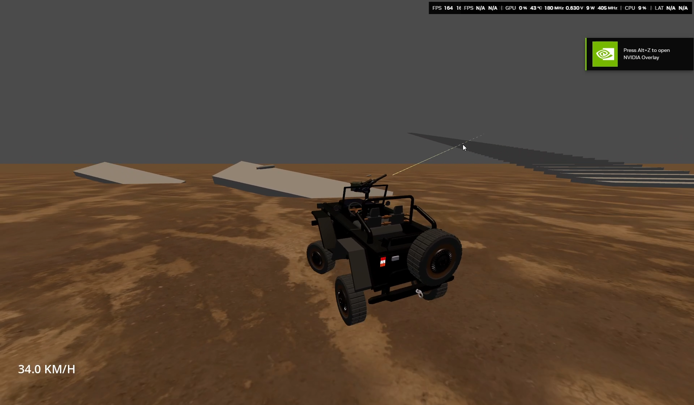

Welcome to **Bloddy Bonkers**, an open-source, high-octane vehicle action game built from the ground up in the Godot Engine. Featuring custom raycast-based vehicle physics, satisfying shooting mechanics, and dynamic camera angles, this project serves as both an exciting game and a fantastic learning resource for Godot developers.

---

## ✨ Features

*   🚙 **Custom Raycast Vehicle Physics:** Smooth, highly-tunable suspension and handling using raycast nodes for the wheels, avoiding the jitter sometimes found in standard rigid-body vehicle nodes.
*   🔫 **Combat Mechanics:** Integrated shooting system linked to the player's view/turret.
*   🎥 **Dynamic Camera System:** Seamlessly toggle between different camera perspectives on the fly.
*   💨 **Boost System:** Speed boost mechanics for escaping tight situations or chasing down targets.

---

## 🎮 Controls

| Input | Action |
| :--- | :--- |
| **W, A, S, D** | Drive (Accelerate, Brake/Reverse, Steer) |
| **Shift** | Boost / Nitrous Speed |
| **C** | Change Camera Perspective |
| **Left Mouse Click** | Fire Weapon |

---

## 📸 Screenshots & Gameplay

*(Showcase your game here! Good visuals are the best way to get people interested in your repository. Replace the placeholders with your actual screenshots or GIFs).*

  

---

## 🛠️ Getting Started

To play the game or explore the source code yourself, follow these steps:

### Prerequisites
*   [Godot Engine](https://godotengine.org/download/) (Version 4.x recommended)
